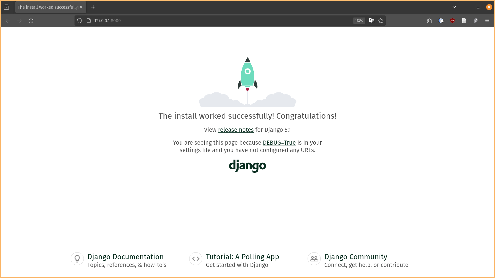
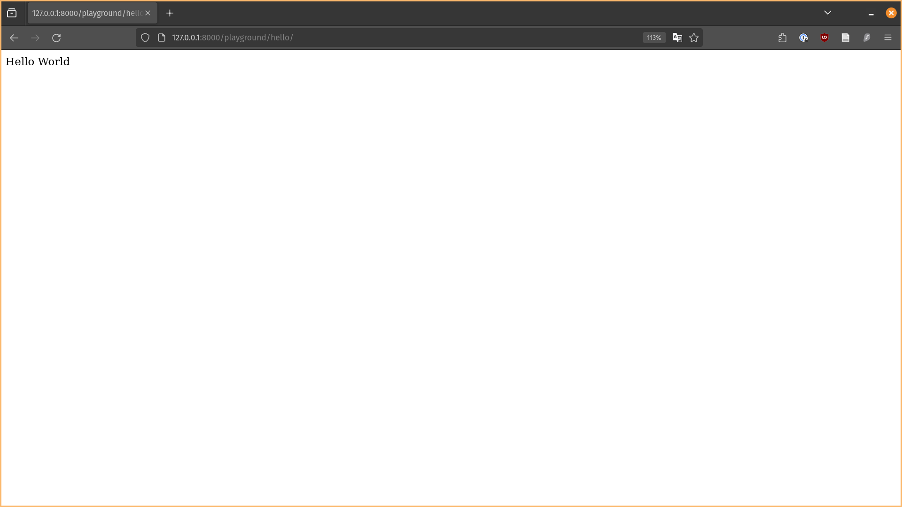
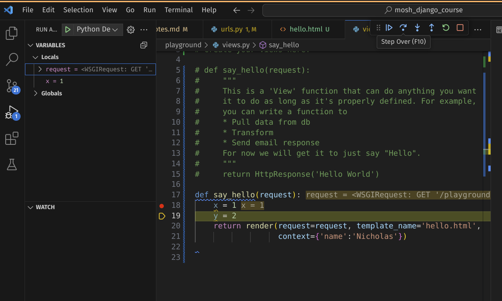
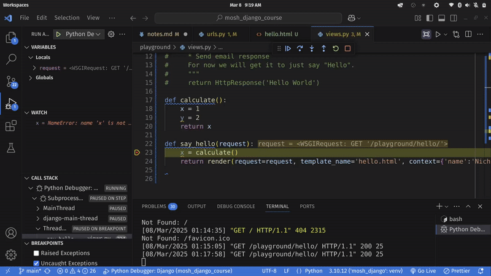

## Starting a project

Run this in your terminal:

```
django-admin startproject [your_project_name]
```

ie. Suppose your project name is "storefront"

```
django-admin startproject storefront
```
The result is that `django` will create a folder named after your project name.
Inside that, there will another directory with your project name.

```
.
└── storefront
    └── storefront
```

To avoid creating this duplicate folder, you should add a period `.` at the end, as such:

```
django-admin startproject storefront .
```

What you'll get inside the project folder will be

```
.
└── storefront
    ├── __init.py
    ├── asgi.py
    ├── settings.py
    ├── urls.py
    └── wsgi.py
```

`__init__.py`: Defines the directory as a package, just as what you would normally do when you import a class from another folder. 

`settings.py`: Settings module to define your settings.

`urls.py`: Defines what urls get used for your project.

`asgi.py`/`wsgi.py`: For web deployment. Too complicated for me to understand now.

Other files that are created:

`manage.py`: A wrapper for `django-admin`, it goes a step further by taking the settings you defined into a account.

i.e.

```
django-admin runserver
```

vs

```
python manage.py runserver
```

They do the same thing, but `manage.py` will look at your settings file but `django-admin` will not. FYI: If you run the above in your terminal, you'll go to your development site.



## Creating apps

Mosh (I paraphrase): Each Django app is just a collection of apps, each providing several functionalities.

Go into your settings module to look up the apps under `INSTALLED_APPS`. 

i.e.
```python
INSTALLED_APPS = [
    'django.contrib.admin',
    'django.contrib.auth',
    'django.contrib.contenttypes',
    'django.contrib.sessions',
    'django.contrib.messages',
    'django.contrib.staticfiles',
]
```

We have apps for admin, authentication etc. 

[Timestamp: 24:04]

To create an app (called "playground"), run the following terminal command (At this point, I created a new terminal as Mosh instructed)

```
python manage.py startapp playground
```
What it does is create a new folder with a standard Django structure. The folder has the same name as our app, "playground".

After creating an app, you need to "register the app" in the settings module, under the list of installed apps. 

<u>In `settings.py`</u> 

*Before*
```python
INSTALLED_APPS = [
    'django.contrib.admin',
    'django.contrib.auth',
    'django.contrib.contenttypes',
    'django.contrib.sessions',
    'django.contrib.messages',
    'django.contrib.staticfiles',
]
```

*After*
```python
INSTALLED_APPS = [
    'django.contrib.admin',
    'django.contrib.auth',
    'django.contrib.contenttypes',
    'django.contrib.sessions',
    'django.contrib.messages',
    'django.contrib.staticfiles',
    # Our newly added app
    'playground'
]
```
## Views

Recall that HTTP is a request, response protocol. There is a data exchange in both request, response. Here's where we use 'Views' in Django.

'Views' is a function that takes a request and returns a response

i.e.

```
Views(request) -> response
```

More accurately, it's a "request handle". 


```python
from django.shortcuts import render
from django.http import HttpResponse
# Create your views here.

def say_hello(request):
    """
    This is a 'View' function that can do anything you want
    it to do as long as it's properly defined. For example,
    you can write a function to
    * Pull data from db
    * Transform
    * Send email response
    For now we will get it to just say "Hello".
    """
    return HttpResponse('Hello World')
    
```

After writing our first 'View' function, we want to map it to a URL. When we get a request from that URL, this function will be called. 

To map this url to your 'View' function, we add a file called `url.py` in the playground folder. (Remark: You can allthe file anything, the name doesn't matter.)

After writing your URL map in our custom app `playground`, we want to add that to the overall URL config in `storefront`. Inside
`storefront/urls.py`, we see this helpful comment at the top.

```python
"""
--cut--
Including another URLconf
    1. Import the include() function: from django.urls import include, path
    2. Add a URL to urlpatterns:  path('blog/', include('blog.urls'))
--cut--
"""
```
So we follow the instructions given in the comments.

*Excerpt from `storefront/urls.py`*
```python
urlpatterns = [
    path('admin/', admin.site.urls),
    path('playground/', include('playground.urls'))

```

*Excerpt from `playground/urls.py`*
```python
urlpatterns = [
    # NOTE: Always end route with a forward slash.
    path(route='hello/', view=views.say_hello)
]
```




## Templates

Mosh (paraphrased): "Views in Django are not really views, they are more like request handlers. What you often call a 'view' in other frameworks is called a 'template' in Django."

Templates are used to return html content to the client.

Step 1: Create a new folder called `templates` in your playground folder. 

Step 2: Create a template file, name it whatever you want. In Mosh's example, he names it `hello.html`. 

Step 3: Now that we have a template, we want to display our response (the output of the view function) to the client in a custom html template. For example, we want the 'View' function to return 'Hello World' using within `<h1>` tags. And we don't want to hard code this inside our view function, but instead customise it in our template `hello.html`, which again, resides in our `templates` folder. 

We have to make some tweaks to the view function, since we no longer want to print plain text but render it through the HTML template of our choice. Before we had the 'View' function return a HTTP response `HttpResponse('Hello World')` but now we want to return a **render** of the HTML template. 

*Before*
```python
def say_hello(request):
    return HttpResponse('Hello World')
```

*After*
```python
def say_hello(request):
    return render(request=request, template_name='hello.html')
```

`hello.html`:
```html
<h1>Hello World</h1>
```

*Me to myself: "capeesh?"*


Now we can change the html file to also output variables, not just hard-coded plain text. To do so:

Step 1: Pass in an argument to the `context` parameter in your 'View' function `say_hello`.

```python
def say_hello(request):
    return render(request=request, template_name='hello.html',
                  context={'name':'Nicholas'})
```

Step 2: Edit your html file to include the variable name, which is the key value of the dictionary. In our case, `'name'`. The HTML will render the value, `'Nicholas'`.

```html
<h1>Hello {{ name }}</h1>
```


## Debugging in VSCode

Step 1: In your IDE, click the 'Run & Debug' button, create a `launch.json` file.

Add breakpoint, run debugger. Invoke breakpoint by going to playground/hello url.

You can click 'Step Over' (shortcut F10) which will run the breakpoint line and go to the next one. You'll have a local variable `x` now. 'Step Over' runs the code line-by-line.



You also have 'Step Into', which allows you to inspect what is going on within a function, in case there are any bugs. The difference being that 'Step Over' will evaluate the functio and return the output but 'Step Into' will go inside the function.



You can also 'Step Out' which returns you back to the function call line you were previously at. 

Remember to remove your breakpoints after you are done debugging.

Tip: You can use CTRL + F5 to run the project instead of running the `python manage.py runserver` command in your terminal.

## Django Debug Toolbar

Step 1: After you've pip-installed `django-debug-toolbar`, add it to your installed apps.

Step 2: Add a new urlpattern inside the main URLconf module.

Step 3: Add middleware

Step 4: Add IP address to your `settings.py` file. It is not created by default, just copy and paste this anywhere in the file.

```python
INTERNAL_IPS = [
    # ...
    "127.0.0.1",
    # ...
]
```

^ [All steps found on django-debug-tool-bar documentation site.](https://django-debug-toolbar.readthedocs.io/en/latest/installation.html)

Ok...so at this point I realised that the 
